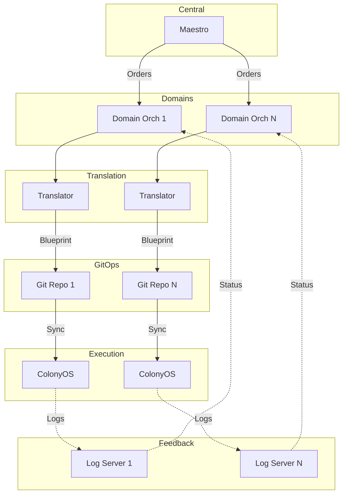
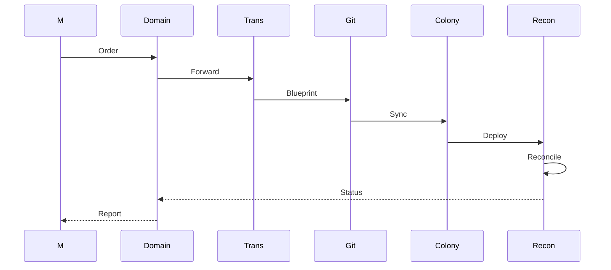
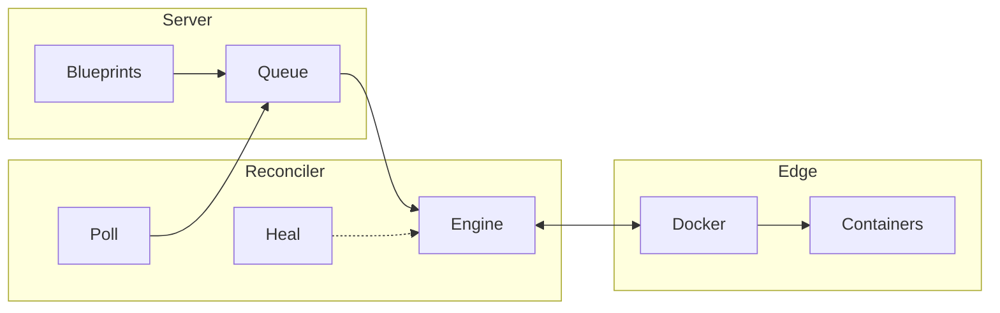
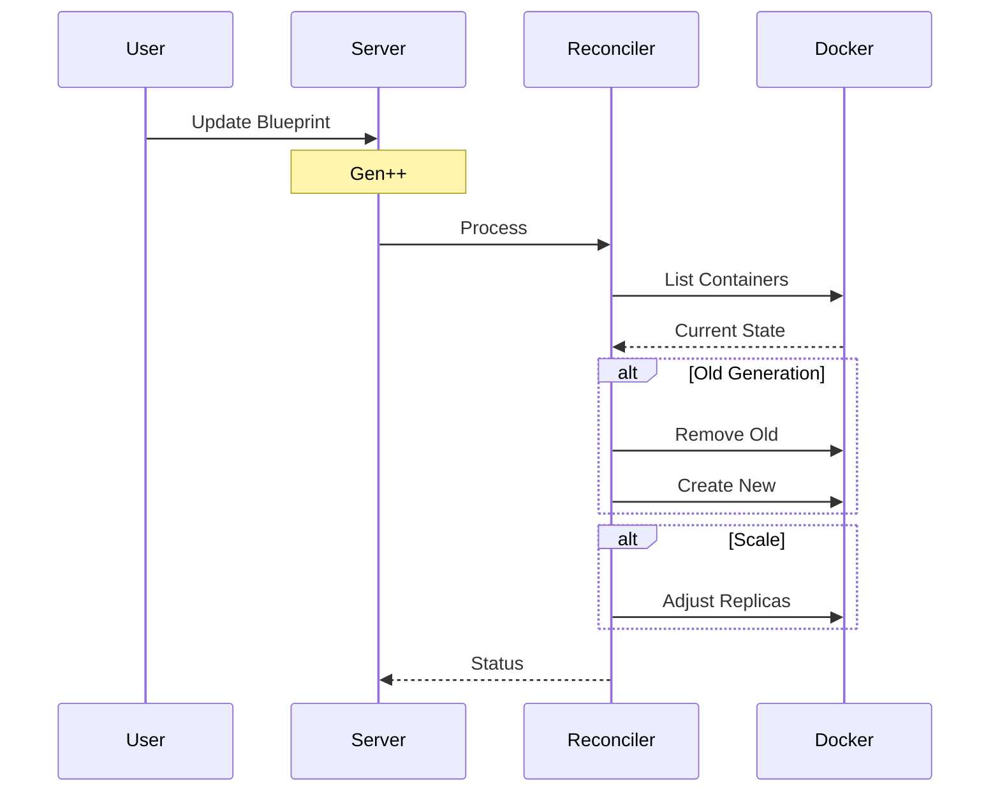
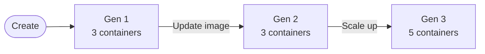

# COP-Pilot ColonyOS Integration

This repository provides integration software for deploying software such as **Eclipse Arrowhead Framework** and **ColonyOS executors** as part of the **COP-Pilot EU project**, enabling distributed edge computing orchestration across European domains through OpenSlice and ColonyOS.

## About COP-Pilot

**COP-Pilot** is an EU-funded research initiative creating an open, multi-layer orchestration platform for collaborative applications across service domains. 

### Cluster 1

This integration repository focuses on **Cluster 1** use cases involving:

- **[RockSigma](https://www.rocksigma.com)**: Seismic monitoring and data processing for underground mining operations (already using ColonyOS)
- **[Thingwave](https://www.thingwave.com/)**: IoT solutions for mining operations
- **[Predge](https://predge.se)**: AI-powered predictive maintenance for rail and mining equipment
- **[Hosch](https://www.hosch-international.com)**: Conveyor belt cleaning and monitoring systems for mining

### Key Value Proposition

**Managing software deployments at remote industrial sites (mines, factories, rail infrastructure) is challenging today because:**
- Traditional orchestrators (Kubernetes, Docker Swarm) require direct network access and VPN connectivity
- Industrial sites often have restricted network access, firewalls, and air-gapped environments
- Managing infrastructure across multiple administrative domains requires complex coordination
- Centralized orchestration creates single points of failure and doesn't scale across distributed edge locations
- IoT devices and embedded systems are too resource-constrained for heavy orchestration platforms

**COP-Pilot solves this by:**

**Decentralized Reconciliation**: Unlike Kubernetes which requires control plane connectivity, ColonyOS executors pull work from the server. This means mines and industrial plants can be behind NAT/firewalls - reconcilers reach out, making direct access unnecessary.

**Lightweight Architecture**: Inspired by Kubernetes reconciliation patterns but designed for resource-constrained environments. ColonyOS can manage IoT devices, embedded Arrowhead systems, and edge infrastructure where traditional orchestrators are too heavy. The reconciler architecture is extensible - different reconcilers can manage different infrastructure types (Docker containers, VMs, Kubernetes clusters).

**Indirect Management via GitOps**: Domain orchestrators commit blueprints to Git repositories. ColonyOS reconcilers automatically sync and deploy - no direct orchestrator-to-site connection needed. Changes propagate through Git, enabling infrastructure-as-code practices at the edge.

**Multi-Domain Orchestration**: Maestro coordinates across European domains, each with local OpenSlice orchestrators, which control ColonyOS clusters at mine sites. This hierarchical model respects organizational boundaries while enabling centralized coordination.

This makes it possible for the first time to manage software deployments at remote mines and industrial facilities indirectly through declarative blueprints, without requiring direct network access to edge infrastructure.

## Architecture

**COP-Pilot** uses a hierarchical orchestration model:
- **Domain Orchestrators**: Regional OpenSlice instances managing local infrastructure
- **Maestro**: Central orchestrator coordinating all Domain Orchestrators
- **ColonyOS**: Compute continuum layer executing workloads via reconcilers



### Integration Flow



## ColonyOS Reconciliation

**Reconciliation** maintains desired infrastructure state declaratively, similar to Kubernetes controllers.

**Key Features:**
- Declarative blueprints define desired state
- Continuous drift detection and correction
- Generation-based zero-downtime updates
- Self-healing every 60 seconds
- Extensible reconciler architecture supporting multiple infrastructure types

**Current Implementation**: The **docker-reconciler** manages Docker containers for Arrowhead Framework and ColonyOS executors.

**Planned Reconcilers**: OpenNebula reconciler (VMs), Kubernetes reconciler (K8s clusters), and network reconciler will extend management to additional infrastructure types at mine sites and industrial facilities.



### Reconciliation Process



### Generation-Based Updates

Each blueprint update increments the generation counter, enabling:
- Automatic detection of outdated containers
- Zero-downtime rolling updates
- Easy rollback via generation tracking



### Blueprint Types

**ExecutorDeployment** - Deploy ColonyOS executors with auto-registration:
```json
{
  "kind": "ExecutorDeployment",
  "metadata": {"name": "docker-pool"},
  "spec": {
    "image": "colonyos/dockerexecutor:latest",
    "replicas": 5,
    "executorType": "container-executor"
  }
}
```

**DockerDeployment** - Deploy multi-container applications:
```json
{
  "kind": "DockerDeployment",
  "metadata": {"name": "arrowhead-cloud"},
  "spec": {
    "instances": [
      {
        "name": "service-registry",
        "image": "aitiaiiot/arrowhead-system:4.6.1",
        "ports": [{"host": 8443, "container": 8443, "protocol": "tcp"}]
      }
    ]
  }
}
```

## Components

| Component | Status | Purpose |
|-----------|--------|---------|
| **Maestro** | Production | Central orchestrator coordinating all domains |
| **Domain Orchestrators** | Production | OpenSlice instances managing regional infrastructure |
| **Service Order Translator** | Planned | Converts OpenSlice orders → ColonyOS blueprints |
| **GitOps Layer** | Planned | Git repos as source of truth for blueprints |
| **ColonyOS Clusters** | Production | Distributed execution with reconcilers |
| **Log Servers** | Planned | Async feedback to domain orchestrators |

## Current Implementation

### Arrowhead Framework Deployment

Complete Eclipse Arrowhead cloud deployment via blueprints:
- Database (MySQL/TimescaleDB)
- 6 core systems: Service Registry, Authorization, Orchestrator, Event Handler, Gatekeeper, Gateway

Location: `colonyos/blueprints/arrowhead/`

### Container Executor Deployment

Deploy additional executors for compute capacity scaling.

Location: `colonyos/blueprints/container-executor/`

### Blueprint Definitions

Custom Resource Definitions:
- `DockerDeployment`: Containerized applications
- `ExecutorDeployment`: ColonyOS executors

Location: `colonyos/blueprints/definitions/`

## Getting Started

### Prerequisites

- ColonyOS server running with configured colony
- Docker reconciler executor registered and running
- ColonyOS CLI installed and configured
- Access to blueprint repository

See [ColonyOS documentation](https://github.com/colonyos/colonies) for installation instructions.

### Deploy Arrowhead Framework

```bash
cd colonyos/blueprints/arrowhead
./deploy-arrowhead-c1.sh

# Monitor
colonies blueprint ls
colonies blueprint get --name c1-serviceregistry
```

### Deploy Additional Executors

```bash
colonies blueprint add --spec colonyos/blueprints/container-executor/local-docker-executor-deployment.json
```

### Cleanup

```bash
cd colonyos/blueprints/arrowhead
./cleanup-arrowhead-c1.sh
```

## Current Workflow (Without GitOps)

1. Manual blueprint creation
2. Direct deployment: `colonies blueprint add --spec blueprint.json`
3. Reconciler executes deployment
4. Status monitoring: `colonies blueprint ls`

## Future Development

### High Priority
- [ ] GitOps sync mechanism in ColonyOS
- [ ] Service Order Translator (OpenSlice → Blueprints)
- [ ] Log server integration for async feedback

### New Reconcilers
- [ ] **OpenNebula reconciler**: Deploy and manage VMs for heavier workloads at industrial sites
- [ ] **Kubernetes reconciler**: Manage Kubernetes clusters at edge locations with sufficient resources
- [ ] **Network reconciler**: Configure network infrastructure declaratively using OpenZiti 

### Medium Priority
- [ ] Enhanced blueprint types for multi-infrastructure deployments
- [ ] Monitoring and metrics integration
- [ ] Cross-reconciler orchestration (e.g., VM + containers + K8s in one blueprint)

## References

- [COP-Pilot EU Project](https://cop-pilot.eu)
- [ColonyOS](https://github.com/colonyos/colonies)
- [Eclipse Arrowhead](https://github.com/eclipse-arrowhead)
- [OpenSlice](https://openslice.io/)

## License

Apache License 2.0 - See LICENSE file
