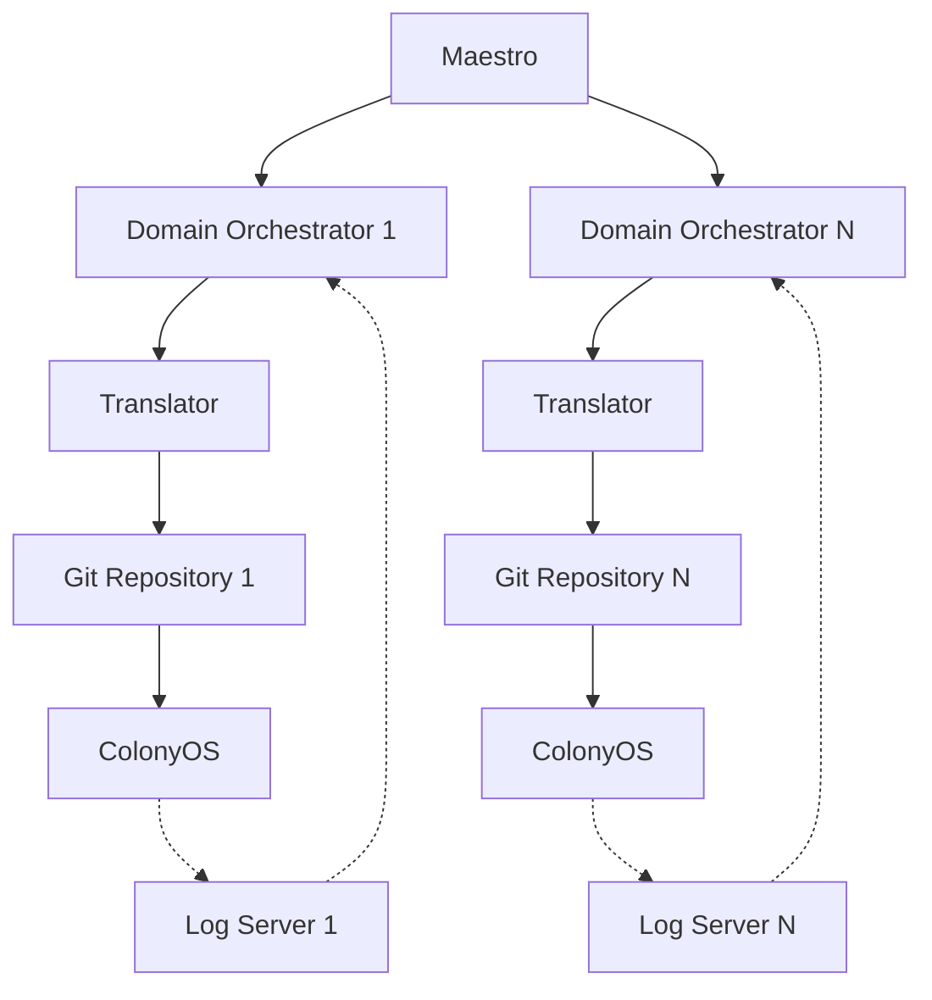
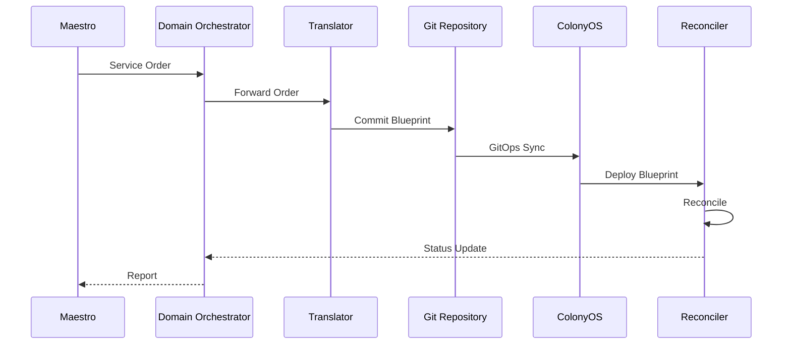
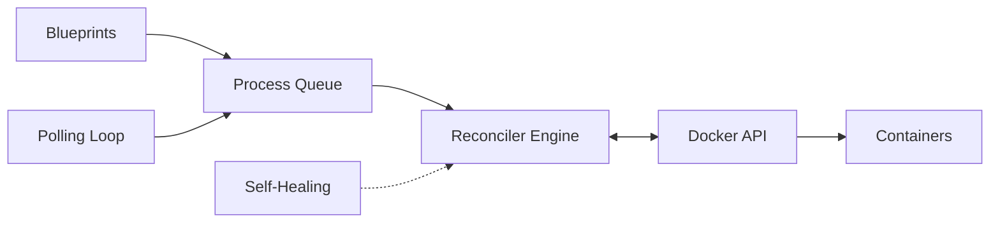
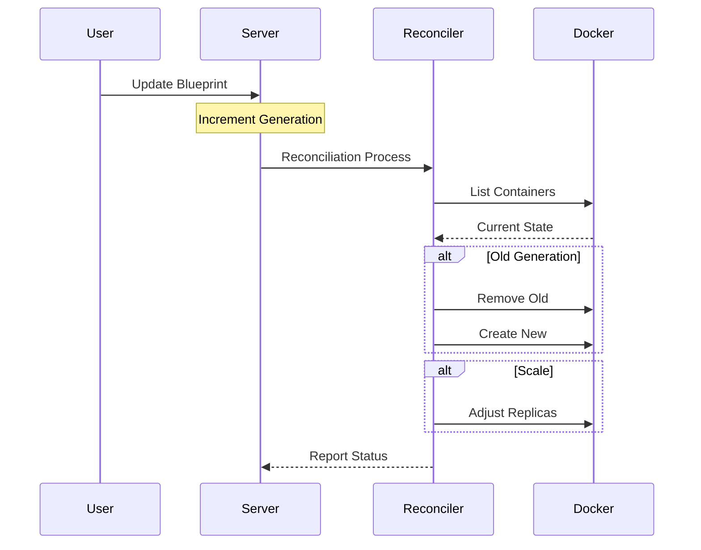

# COP-Pilot Cluster 1 Integration

**COP-Pilot** is an EU-funded research initiative creating an open, multi-layer orchestration platform for collaborative applications across service domains.

This repository provides integration software for deploying software such as **Eclipse Arrowhead Framework** and **ColonyOS executors** as part of the **COP-Pilot EU project**, enabling distributed edge computing orchestration across European domains through OpenSlice and ColonyOS.

## Key Value Proposition

**Managing software deployments at remote industrial sites (mines, industrial infrastructure) is challenging today because:**
- Traditional orchestrators (e.g. Kubernetes) require direct network access and VPN connectivity
- Industrial sites often have restricted network access, firewalls, and air-gapped environments
- Managing infrastructure across multiple administrative domains requires complex coordination
- Centralised orchestration creates single points of failure and doesn't scale across distributed edge locations
- IoT devices and embedded systems are too resource-constrained for heavy orchestration platforms

**COP-Pilot solves this by:**

**Decentralised Reconciliation**: Unlike Kubernetes which requires control plane connectivity, ColonyOS executors pull work from the server. This means mines and industrial plants can be behind NAT/firewalls and ColonyOS reconcilers can still reach out, making direct access unnecessary.

**Lightweight Architecture**: Inspired by Kubernetes reconciliation patterns but designed for resource-constrained environments. ColonyOS can manage IoT devices, embedded Arrowhead systems, and edge infrastructure where traditional orchestrators are too heavy. The reconciler architecture is extensible - different reconcilers can manage different infrastructure types (Docker containers, VMs, Kubernetes clusters, or application reconfiguration).

**Indirect Management via GitOps**: Domain orchestrators commit blueprints to Git repositories. ColonyOS reconcilers automatically sync and deploy, this no direct orchestrator-to-site connection needed. Changes propagate through Git, enabling infrastructure-as-code practices at the edge.

**Multi-Domain Orchestration**: Maestro coordinates across European domains, each with local OpenSlice orchestrators, which control ColonyOS clusters at mine sites. This hierarchical model respects organisational boundaries while enabling centralised coordination.

This makes it possible for the first time to manage software deployments at remote mines and industrial facilities indirectly through declarative blueprints, without requiring direct network access to edge infrastructure.

This integration repository focuses on **Cluster 1** use cases with the following industrial partners:

**[RockSigma](https://www.rocksigma.com)** - Seismic monitoring and data processing for underground mining
- Already using ColonyOS for their BEMIS seismic processing system
- **Value**: Cloud bursting - combine on-premise edge processing at mine sites with cloud resources for heavy computational workloads. Process time-critical seismic data locally while leveraging cloud for advanced analytics and long-term processing.
- **Value**: Unified orchestration across multiple mine sites globally, managing distributed seismic monitoring infrastructure from a single control plane

**[Thingwave](https://www.thingwave.com/)** - IoT solutions for mining operations
- **Value**: Manage thousands of IoT sensors and devices across remote mine sites without requiring direct network access
- **Value**: Deploy and update edge analytics software on IoT gateways at mines through GitOps, eliminating manual site visits

**[Predge](https://predge.se)** - AI-powered predictive maintenance for rail and mining equipment
- **Value**: Deploy AI/ML models for predictive maintenance at the edge (on trains, mining equipment) where connectivity is intermittent
- **Value**: Continuous model updates via GitOps - update predictive models across distributed rail and mining assets without direct connectivity

**[Hosch](https://www.hosch-international.com)** - Conveyor belt cleaning and monitoring systems
- **Value**: Manage conveyor monitoring systems across multiple mine sites centrally
- **Value**: Deploy software updates to embedded systems in conveyor belt monitoring equipment at remote locations

## Architecture

**COP-Pilot** uses a hierarchical orchestration model:
- **Domain Orchestrators**: Regional OpenSlice instances managing local infrastructure
- **Maestro**: Central orchestrator coordinating all Domain Orchestrators
- **ColonyOS**: Compute continuum layer executing workloads via reconcilers and meta processes



### Integration Flow



## ColonyOS Reconciliation

**Reconciliation** maintains desired infrastructure state declaratively, similar to Kubernetes controllers.

**Key Features:**
- Declarative blueprints define desired state
- Continuous drift detection and correction
- Generation-based zero-downtime updates
- Self-healing every 60 seconds
- Extensible reconciler architecture supporting multiple infrastructure types

**Current Implementation**: The **docker-reconciler** manages Docker containers for Arrowhead Framework and ColonyOS executors.

**Planned Reconcilers**: OpenNebula reconciler (VMs), Kubernetes reconciler (K8s clusters), and network reconciler will extend management to additional infrastructure types at mine sites and industrial facilities.



### Reconciliation Process



## Current Implementation

### Arrowhead Framework Deployment

Complete Eclipse Arrowhead cloud deployment via blueprints:
- Database (MySQL/TimescaleDB)
- 6 core systems: Service Registry, Authorization, Orchestrator, Event Handler, Gatekeeper, Gateway

Location: `colonyos/blueprints/arrowhead/`

### Container Executor Deployment

Deploy additional executors for compute capacity scaling.

Location: `colonyos/blueprints/container-executor/`

### Blueprint Definitions

Custom Resource Definitions:
- `DockerDeployment`: Containerized applications
- `ExecutorDeployment`: ColonyOS executors

Location: `colonyos/blueprints/definitions/`

## Getting Started

### Prerequisites

- ColonyOS server running with configured colony
- Docker reconciler executor registered and running
- ColonyOS CLI installed and configured
- Access to blueprint repository

See [ColonyOS documentation](https://github.com/colonyos/colonies) for installation instructions.

### Deploy Arrowhead Framework

```bash
cd colonyos/blueprints/arrowhead
./deploy-arrowhead-c1.sh

# Monitor
colonies blueprint ls
colonies blueprint get --name c1-serviceregistry
```
